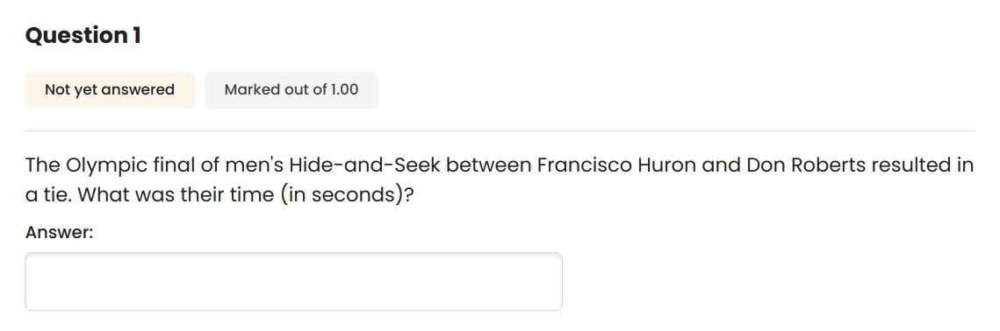

# Question types
The sections below show the question types from Moodle that are supported by the MoodlishInquisition library.

For question types where examples images are shown, the source code for generating the question may be found in [the package documentation](https://pkg.go.dev/github.com/ReneBoedker/MoodlishInquisition).

## Drag and drop into text
This question type is implemented in the `DropText` type.

## Drag and drop markers
This question type is implemented in the `DropMarker` type.

These questions contain an image onto which the markers are to be dropped. When creating one of these questions, the image must be base64 encoded. It is then bundled into the generated XML data.

## Multiple choice
This question type is implemented in the `MultiChoice` type. If there are more than a single correct answer, the package will automatically switch between 'One answer only' and 'Multiple answers allowed'.

## Numerical
This question type is implemented in the `Numerical` type. To set answer tolerances, use the `SetOptions` method of the `Answer` type.
Handling of units is currently not supported.

## Short Answer
This question is implemented in the `ShortText` type.

For this type of question, it would be common to add specific feedback for partially correct answers. This is possible via the `NewAnswerWithFeedback` function.

